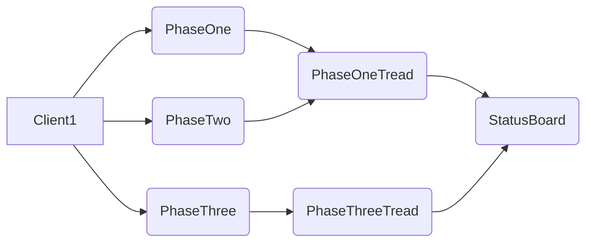
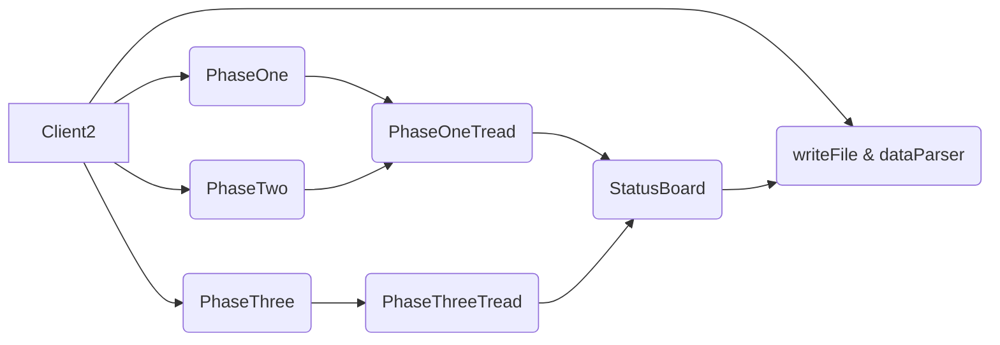

# CS6650-ASSIGNMENT1

Link: https://github.com/zxhuo/CS6650_ASSIGNMENT1
# About Repo

This repo has three parts. Server, Client, and Client2. Client is the client corresponding to part1. Client2 is the client corresponding to part2.

## How Server Workse
Server is in the folder called `Server`.

I've finished implement all the server API, and the server is able to check the parameters for each operations as per the specification.

If basic parameters are valid, return a 200/201 response code. Otherwise, 4xx response code will be returned and error message will be printed. 

## How Client Works (Part1)
Client(Part 1) is in the folder called`Client`.

The starting point of my client is `Client.java`. 

- First, users pass the CLI arguments to Client. 
	- If arguments are invalid or missing, a corresponding error message would be printed.
	
- Then, Client will create three objects:`PhaseOne`, `PhaseTwo`, and `PhaseThree`. They are corresponding to the three phases in assignment. 
	- `PhaseOne` has one `run()` method. `run()`will launch numThreads/4 `PhaseOneThread`, and start a `CountDownLatch`, which is used to monitor the processing of thread.
		- `PhaseOneThread` will initialize `ApiClient` and `SkiersApi`. Then try to use `writeNewLiftRide` to send (numRunsx0.2)x(numSkiers/(numThreads/4)) POST request. A for loop is used to re-try if it fails. Once all requests are send, thread will update successful request, and unsuccessful request to a shared `StatusBoard`, which is synchronized. the Latch countdowns, then close thread.
		
	- `PhaseTwo` and `PhasesThree`is similar as `PhaseOne`, but with different inputs. The thread used in `PhaseTwo` is`PhaseOneThread`. The thread used in `PhaseThree` is`PhaseThreeThread`. `PhaseThreeThread` is similar as `PhaseOneThread`, but with different number of post requests.
	

- Next, create a timestamp used to record start time, and run three phares. 
- When all threads are finished, create a timestamp used to record end time.
- Finally, client prints successful requests, unsuccessful request, total requests, wall time, and throughput.
- Client closes.

## How Client Works (Part2)
Client(Part 2) is in the folder called`Client2`.

The starting point of my client is `Client2.java`. 

- Client2 does all things Client does, but not close yet.

- The all three `phasesThread` classes has its own timestamps used to record response time. Also, they will store a recording including the start time, request type (ie POST), latency, response code. Before thread close, the records are save in a shared `StatusBoard`. 
- When all threads are finished, Client2 will run `writeFile()` 
and `dataParser()`. writeFiles is used to write a CSV.file containing all requests status. dataParser is used to calculate and print mean response time, median response time, throughput, p99, min and max response time.
- Client2 close.

## Relationships
Client1

Client2

